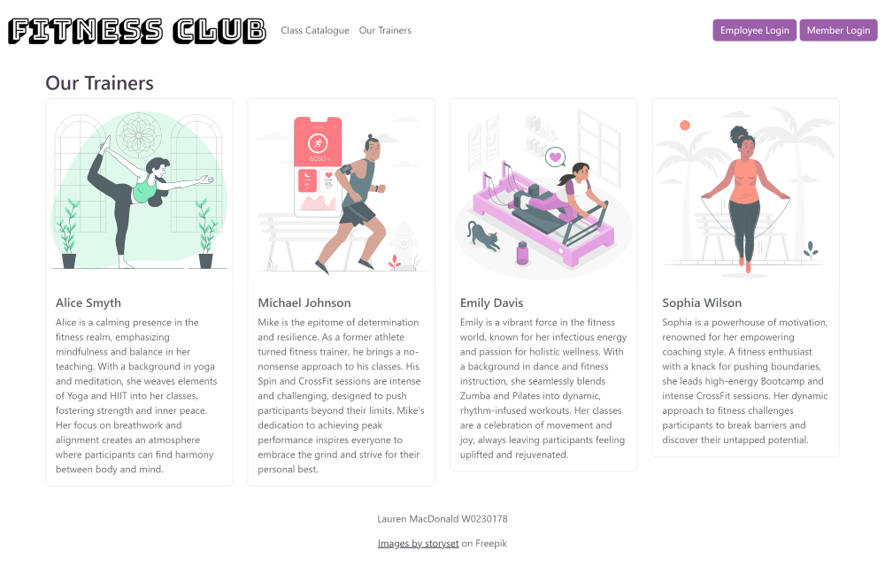

# Fitness Club Management System

> **Completed for INET2005 Final Project**
>
> Lauren MacDonald, December 2023
>
> **Languages/Concepts**: PHP, MVC Design, Object-Oriented Programming principles, HTML, CSS, Bootstrap, Javascript

## How To Use
### XAMPP
This program is set up to connect with MySQL and can be used with XAMPP to access the server. To download XAMPP:
https://www.apachefriends.org Follow the installation and set up instructions.

### Server Credentials
username: root

password: none

### Creating the database and applicable tables
Import the SQL document 'fitnessclub.sql' into MySQL.

### Access point
Load the page index.php to use the website!

## Background
### INET2005 Final Project Instructions:
Website for a fictitious fitness gym. Three types of users: member, trainer and admin.

#### Admin
- Can log in
- Add/delete/update member and trainer information
- Add class to schedule and remove class from schedule

#### Member
- Can log in
- Check schedule
- Add class to their schedule

#### Trainer
- Can log in
- Check their scheduled shifts
- Mark attendance of the members in their classes

### Requirements:
Demonstrate understanding of PHP and web application development concepts such as:
- dynamic input/output
- variables and data types
- functions
- logic control statements
- GET/POST, forms
- MVC Design

## Project Execution
### Model View Controller Design
The MVC design was used to structure the project. Each major functionality (such as login) has a model, view and controller class.
There are abstract (super) classes for model, view and controller which extend to the model, view controller classes for
the website functionality.

#### Models
The Models directory holds the classes with SQL query methods that connect to the database to retrieve the data.
Also includes the functions folder which holds specific php files with SQL queries to book a class, add a class and mark a member
as attending a class.

**Example of a method in the ScheduleModel class**:

#### Views
The Views directory holds the classes with simple php logic to echo certain HTML, dependent on where the views are used.
Also includes the pages folder which hold the HTML to be displayed as the website, with some php used where applicable.

**Example of a method in the ScheduleView class**:

#### Controllers
The Controllers directory holds the classes that process user requests and direct the response applicable to the user requests.
Takes input from the user, assigns applicable authorization and directs the response by connecting the Models to the
Views based on the authorization of the user and the user's request.

**Example of a method in the ScheduleController class**:

### Other Directories and Files
#### Helpers
These PHP files are called on form submission like login, registration, add a new class and process update. The controllers,
views and models are instantiated and called to utilize their functions.
The logout functionality is also housed here, as well as a Validation class for validating user input.

**Helper example, processNewClass.php**:

#### include
Houses the images used within the site as well as the CSS styles document.

#### dbConfig class, sessionConfig file
Used to handle database and session configuration, respectively.

### Other Functionality
URL parameters are used in conjunction with GET methods to display error and success message to users. Example of this
is in the addClass functionality, will display the success message to the user dependent on the URL parameter set when
the function was successfully used. Is also used to redirect and display an error message if an unauthorized user like
a trainer tried to access the page to update user information.

## Screenshots of website
### Index
The index page will display the home landing page when no session variables are set to indicate any users are logged in.
If users are logged in, will display an appropriate index landing page depending on the type of user logged in and the
functionality of the account associated with the type of user (admin has registration, etc.).

**No users logged in**:

**Member and Admin Logged in examples**:

### Login
**Member Login**:

**Employee Login**

### Schedule
Controller and view classes help to determine which schedule content to display depending on set user type session
variables.

**Member Schedule**

Shows display message when not signed up for any classes, the table to sign up for classes,
then updated schedule page after having signed up for one class.

**Trainer Schedule**

**Admin Schedule**

Shows schedule table and Add More Classes collapsable form.

### Trainer and Class Catalogues

**Trainer Catalogue**

**Class Catalogue**

